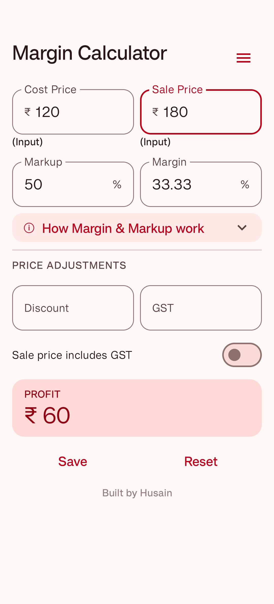
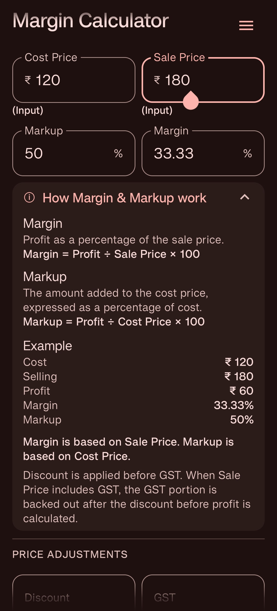
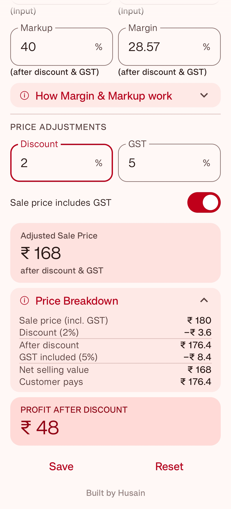
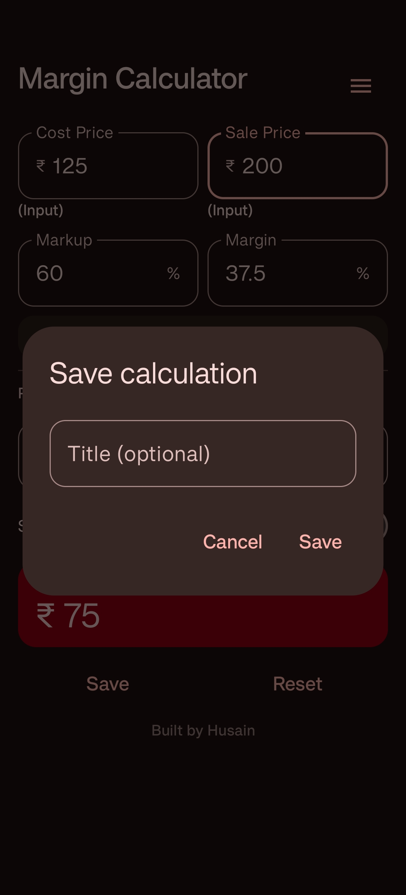
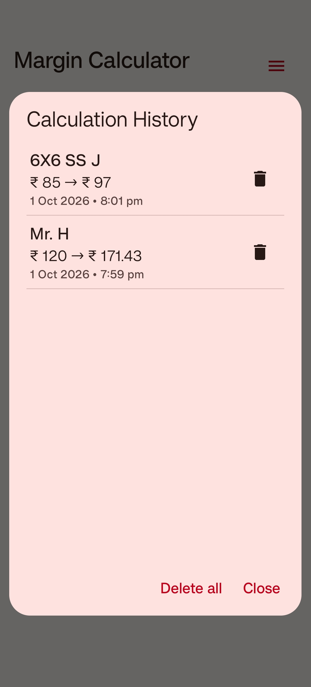
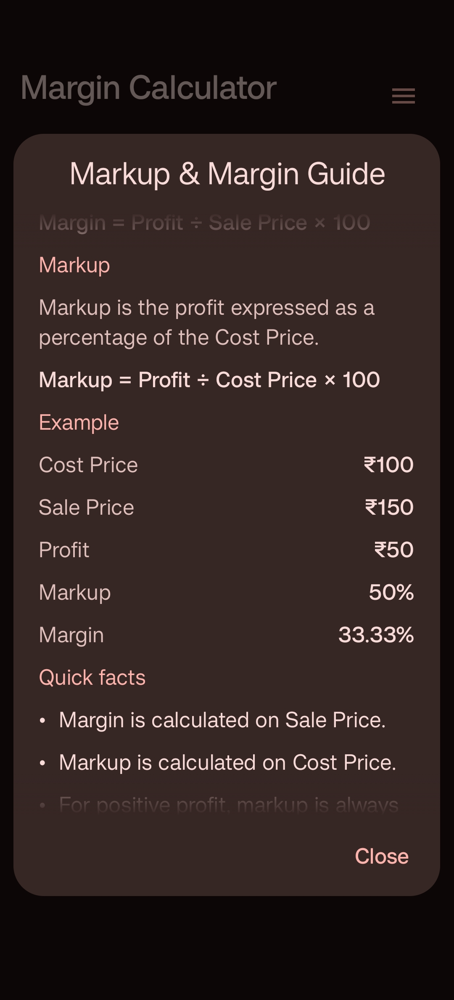

# Margin Calculator

A simple and practical Android app for **product pricing and profitability analysis**. Calculate **Profit, Margin, Markup and Sale Price**, with **Discount and GST adjustments**.

Whether you're setting a sale price for a product, checking your profitability, or adjusting your price for discounts and GST, Margin Calculator gives you the numbers instantly.

## ✨ Features

### 💰 Margin & Markup Calculator

Calculate and understand:

- Cost Price
- Sale Price
- Profit
- Margin %
- Markup %

Enter any **two values** and the app automatically calculates the remaining values.

You can also directly edit Margin or Markup to determine the required Sale Price.

### 🧮 Live Calculations

All calculations update instantly as you change the values.

Discount and GST adjustments are also reflected in the calculated Margin and Markup.

For example:

**Cost Price:** ₹200  
**Sale Price:** ₹250

The app calculates:

- Profit: ₹50
- Margin: 20%
- Markup: 25%

### 🏷️ Discount Adjustment

Apply a discount to the Sale Price and instantly see how it affects:

- Sale Price after discount
- Effective selling value
- Profit
- Margin
- Markup

Discount is applied before GST in the calculation.

### 🧾 GST Adjustment

Specify whether the Sale Price includes GST and see how the GST treatment affects:

- Effective selling value
- Profit
- Margin
- Markup

The calculator handles:

- GST-exclusive Sale Price
- GST-inclusive Sale Price
- GST amount
- Sale Price before GST
- Profit after GST

When GST is included in the customer's final price, the app separates the GST portion before calculating the effective business selling value and profit.

### 📊 Price Breakdown

Expand the Price Breakdown section to see the calculation in detail, including:

- Sale Price
- Discount
- Sale Price after discount
- GST
- Net selling value
- Customer pays
- Profit
- Margin
- Markup

### 📚 Calculation History

Save calculations for later reference with an optional title.

Calculation History allows you to:

- View saved calculations
- View complete calculation details
- Delete individual calculations
- Select and delete multiple calculations
- Delete all calculations with confirmation
- Keep up to 50 saved calculations

Saved calculations are for reference and do not restore values to the calculator.

### 💡 Margin & Markup Explained

Not sure about the difference between Margin and Markup?

The built-in **Markup & Margin Guide** explains:

- How Margin and Markup are calculated
- The difference between them
- The relationship between Margin and Markup
- Why Markup can exceed 100%
- Why Margin cannot reach 100% with a positive Sale Price
- Examples and formulas

### 🎨 Material You Design

Built using modern Android design principles.

Supports Android Dynamic Color.

Choose between:

- **System** — follows your device's Light/Dark mode
- **Light**
- **Dark**

The interface adapts to your device's appearance settings.

### 📱 Simple & Focused

Margin Calculator is designed to help you quickly **calculate and understand product pricing and profitability**.

It focuses on the calculations that matter when setting or evaluating a product's Sale Price, including **Margin, Markup, Discount and GST adjustments**.

No unnecessary accounts, complicated setup or cloud services.

## 📶 Works Offline

Margin Calculator works completely offline.

No internet connection is required for calculations.

Your calculations stay on your device.

## 🔒 Privacy

Margin Calculator does not require an account or sign-in.

- Calculations are performed locally on your device.
- No pricing data needs to be uploaded to a server.
- No cloud service is required for the calculator.
- No personal information is required to use the app.

## 📱 Screenshots

<table width="100%">
  <tr>
    <th width="50%">Main Calculator</th>
    <th width="50%">Margin & Markup</th>
  </tr>
  <tr>
    <td width="50%" align="center">
      
    </td>
    <td width="50%" align="center">
      
    </td>
  </tr>

  <tr>
    <th width="50%">Discount, GST & Price Breakdown</th>
    <th width="50%">Save Calculation</th>
  </tr>
  <tr>
    <td width="50%" align="center">
      
    </td>
    <td width="50%" align="center">
      
    </td>
  </tr>

  <tr>
    <th width="50%">Calculation History</th>
    <th width="50%">Markup & Margin Guide</th>
  </tr>
  <tr>
    <td width="50%" align="center">
      
    </td>
    <td width="50%" align="center">
      
    </td>
  </tr>
</table>

## 📥 Download

**[Download Latest Version](https://github.com/husainmade/MarginCalculator/releases#latest)**

### Requirements

- Android 8.0 (API 26) or later

## 🔐 Source Code

Margin Calculator is distributed as a **closed-source application**.

This repository is provided for app releases, documentation and project information.

## 💬 Feedback

Found a bug or have a suggestion?

Open an issue in this repository and describe the problem or suggestion.

For bug reports, please include:

- Steps to reproduce the problem
- Screenshots, if applicable
- Android version
- Device information, when relevant

## 👨‍💻 Developer

**Husain**

© 2026
